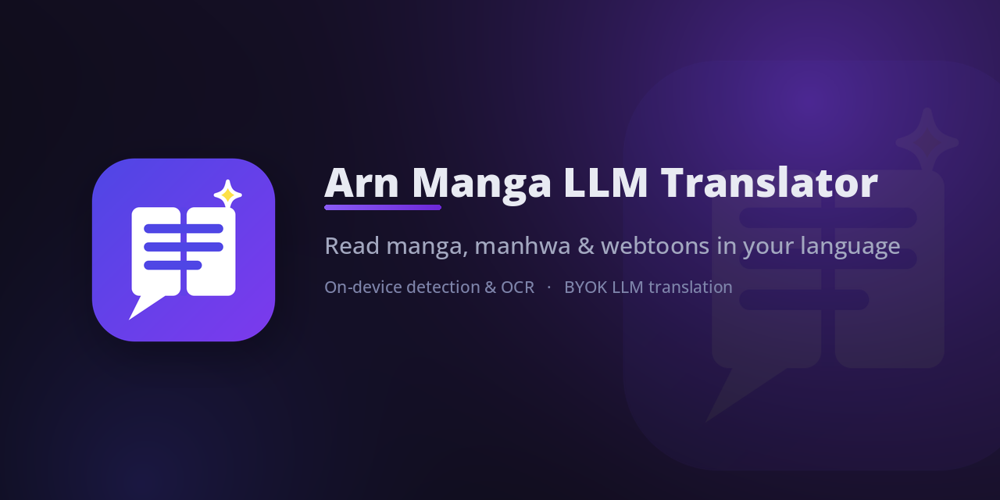

# arn-manga-llm-translator

[](LICENSE)

A zero-server browser extension that machine-translates manga, manhwa and webtoons in your browser.
Original text is detected, read by OCR (or a vision model), translated by an LLM
**you** choose, and rendered back onto the page — everything except the LLM call
runs locally on your machine.

<p align="center">
  
</p>

- **Source languages:** Japanese, Korean, Chinese and English — into any
  language your LLM can write (Thai rendering is battle-tested, including
  ICU dictionary word breaking and shrink-to-fit text layout).
- **Your keys, your models:** bring your own API key (OpenAI-compatible,
  OpenAI Responses, Anthropic, Gemini, Cloudflare Workers AI). Keys never leave
  your browser's local storage, and page images are sent only to the endpoint
  you configure.
- **All detection and OCR run in-browser** — no server, no telemetry. Works on
  most manga reader sites (image-based and canvas-based readers, including
  single-image readers with off-DOM preloading).

## How it works

1. **Detect** — a comic-text-detector model (ONNX, int8) finds speech bubbles
   and text regions on the page, running in a hidden extension-origin iframe
   (WebGPU with a silent wasm fallback).
2. **Read** — text is extracted either by a vision LLM (no language pack
   needed — it reads whatever text is on the page) or by OCR. The bundled
   Baberu OCR model handles JA/EN/ZH well; Tesseract packs cover Japanese,
   English, Korean, and Chinese (simplified + traditional).
3. **Translate** — regions are sent to your LLM with a shared context window:
   a character book (names, genders, speech styles learned from the chapter)
   and recent translation pairs, so pronouns and tone stay consistent page to
   page. Provider-side prompt caching keeps repeat cost down.
4. **Render** — original text is inpainted over and the translation is laid
   out to fit each bubble, with reading-order aware panel ordering.

Results are cached per page (content-hashed, not URL-keyed), so revisiting a
page is instant and free.

## Install

### From source (any OS)

Prerequisites: Node.js 20+ and a Chromium or Firefox browser.

```bash
git clone https://github.com/c0ffeeOverdose/arn-manga-llm-translator.git
cd arn-manga-llm-translator
npm install
node build.mjs            # Chromium → dist/
node build.mjs --firefox  # Firefox → dist-firefox/
```

Then load it as an unpacked extension:

- **Chrome / Chromium:** `chrome://extensions` → enable Developer mode →
  *Load unpacked* → select `dist/`
- **Firefox:** `about:debugging#/runtime/this-firefox` → *Load Temporary
  Add-on* → select any file inside `dist-firefox/`

Models (~150 MB) download automatically on first use and are cached in
IndexedDB — no bundling, nothing shipped in the repo.

## Quick start

1. Open the extension options → **Model**: pick a provider, paste your API key,
   choose a model, press **Test connection**.
2. Choose **How the model reads text**: *Vision* (send the page image) or
   *OCR* (send recognized text only — cheaper).
3. Open any manga chapter, right-click the page → **Translate this page**.
   Use the popup to enable auto-translate, pre-translation ahead of your
   reading position, memory depth, and fonts.

## Optional: cloud inference

If your machine can't run detection comfortably (older laptops, phones), the
extension can send pages to an endpoint you deploy yourself — a one-click
Colab notebook deploys the same detection+OCR pipeline to your own Modal
account (free tier is enough):

[](https://colab.research.google.com/github/c0ffeeOverdose/arn-manga-llm-translator/blob/main/server/cloud-setup.ipynb)

Run all, paste the printed endpoint + key into Options → Model. See
[server/README.md](server/README.md) for details.

## Repository layout

```
src/
  content/      page orchestration: queue, cache, rendering, status UI
  iframe/       ONNX runtime host (extension-origin iframe): CTD + OCR + panel model
  background/   service worker: LLM calls (5 protocols)
  llm/          prompt building, adapters, character book
  options/      settings UI (model, pipeline, character book, fonts)
  popup/        per-site control center
server/         optional cloud inference (Modal, one-click Colab deploy)
scripts/        model export/quantize utilities
tests/          unit tests (node --test)
```

## Development

```bash
npx tsc --noEmit   # typecheck
node --test "tests/**/*.test.mjs" # unit tests
node build.mjs     # build both targets, see above
```

Contribution guidelines: [CONTRIBUTING.md](CONTRIBUTING.md).
Security policy: [SECURITY.md](SECURITY.md).

## License

GPL-3.0-only — see [LICENSE](LICENSE). This project bundles a derivative of
[comic-text-detector](https://github.com/dmMaze/comic-text-detector) (GPL-3.0),
which sets the license for the whole extension. Model attributions are in
[NOTICE](NOTICE).

## Acknowledgements

- [comic-text-detector](https://github.com/dmMaze/comic-text-detector) — text
  detection (ONNX export via
  [lemon-manga-translator](https://github.com/lemondouble/lemon-manga-translator))
- [Baberu OCR](https://huggingface.co/genshiai-daichi/baberu-ocr) —
  Japanese/English/Chinese OCR
- [manga-panel-detector-yolo26n](https://huggingface.co/leoxs22/manga-panel-detector-yolo26n) —
  panel ordering
- [onnxruntime-web](https://github.com/microsoft/onnxruntime-web),
  [Tesseract.js](https://github.com/naptha/tesseract.js)
